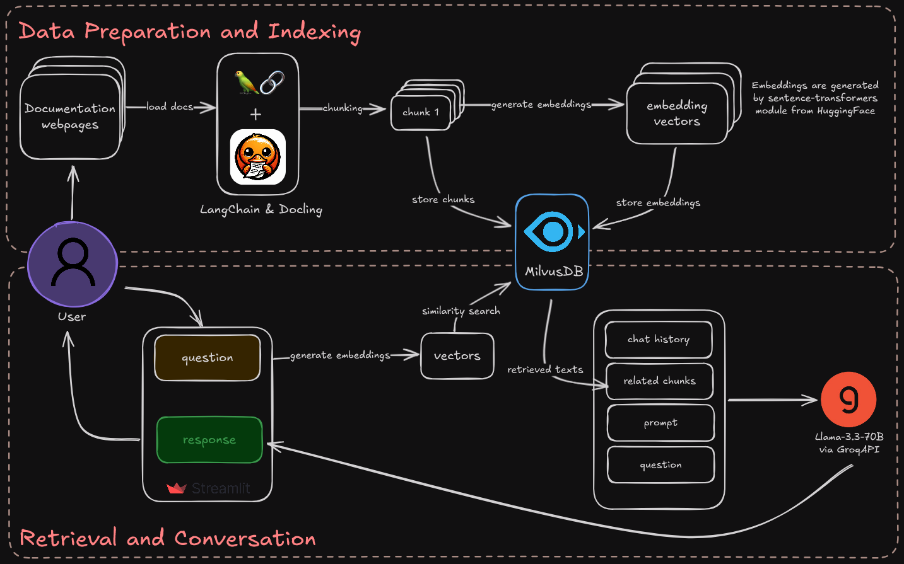

# Chat with Ellie.ai Documentation 🔍🤖

A simple RAG-powered assistant for querying Ellie.ai's technical documentation using natural language.



## Features
- Natural language queries over documentation
- Source citation with document references
- Conversation history tracking
- Hallucination safeguards


## Prerequisites
- Python 3.10+
- Groq/Google Gemini API Key (set as `GROQ_API_KEY` or `GOOGLE_API_KEY` in environment)
- Milvus DB

## Installation
```bash
git clone https://github.com/Senthi1Kumar/chat-with-docs.git
cd chat-with-docs
python -m venv .venv
# source .venv/bin/activate or .venv\Scripts\activate
pip install -r requirements.txt
```

## Configuration
1. Copy example config and update environment variable (.env) with your Groq API:
```bash
cp config/.env.example config/.env
```
2. Update with your:
   - Documentation URLs
   - Milvus connection details - path to store the DB
   - Device preferences (CPU/GPU)

## Usage
1. Ingest documentation:
```bash
python index_docs.py
```
2. Start chat interface:
```bash
streamlit run app.py
```
3. To Execute evaluation, please set the Gemini API key in `.env` file:
```bash
python evaluate.py
```

## Evaluation Framework
The evaluation framework provided in `evaluate.py` is designed to access the performance of our RAG system which leverages Google Generative AI (via `ChatGoogleGenerativeAI` class). It prepares an evaluation dataset, runs the RAG system on a set of pre-defined test questions, and computes multiple evaluation metrics such as *Faithfulness*, *Answer Correctness*, *Context Recall*, *LLM Context Recall*, and *Factual Correctness* using the **RAGAS** library.

## License
MIT License
